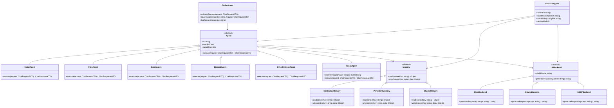

```mermaid
classDiagram
%% Jarvis AI Platform 2026 - Class Diagram

class Orchestrator {
    +validateRequest(request: ChatRequestDTO)
    +routeToAgent(agentId: string, request: ChatRequestDTO)
    +logRequest(requestId: string)
}

class Agent {
    <<abstract>>
    +id: string
    +enabled: bool
    +capabilities: List<string>
    +execute(request: ChatRequestDTO) ChatResponseDTO
}

class CoderAgent {
    +execute(request: ChatRequestDTO) ChatResponseDTO
}

class FilesAgent {
    +execute(request: ChatRequestDTO) ChatResponseDTO
}

class EmailAgent {
    +execute(request: ChatRequestDTO) ChatResponseDTO
}

class DiscordAgent {
    +execute(request: ChatRequestDTO) ChatResponseDTO
}

class CyberDefenceAgent {
    +execute(request: ChatRequestDTO) ChatResponseDTO
}

class VisionAgent {
    +analyzeImage(image: Image) Embedding
    +execute(request: ChatRequestDTO) ChatResponseDTO
}

class Memory {
    <<abstract>>
    +read(contextKey: string) Object
    +write(contextKey: string, data: Object)
}

class ContextualMemory {
    +read(contextKey: string) Object
    +write(contextKey: string, data: Object)
}

class PersistentMemory {
    +read(contextKey: string) Object
    +write(contextKey: string, data: Object)
}

class SharedMemory {
    +read(contextKey: string) Object
    +write(contextKey: string, data: Object)
}

class LLMBackend {
    <<abstract>>
    +modelName: string
    +generateResponse(prompt: string) string
}

class MockBackend {
    +generateResponse(prompt: string) string
}

class OllamaBackend {
    +generateResponse(prompt: string) string
}

class GGUFBackend {
    +generateResponse(prompt: string) string
}

class FineTuningJob {
    +collectDataset()
    +buildDataset(format: string)
    +trainModel(configFile: string)
    +deployModel()
}

%% Relations
Orchestrator --> Agent
Agent <|-- CoderAgent
Agent <|-- FilesAgent
Agent <|-- EmailAgent
Agent <|-- DiscordAgent
Agent <|-- CyberDefenceAgent
Agent <|-- VisionAgent

Agent --> Memory
Memory <|-- ContextualMemory
Memory <|-- PersistentMemory
Memory <|-- SharedMemory

Agent --> LLMBackend
LLMBackend <|-- MockBackend
LLMBackend <|-- OllamaBackend
LLMBackend <|-- GGUFBackend

FineTuningJob --> LLMBackend
FineTuningJob --> Memory
FineTuningJob --> Agent
```